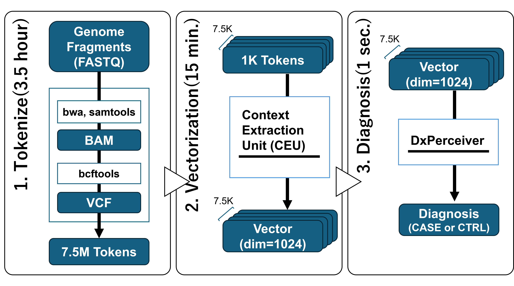
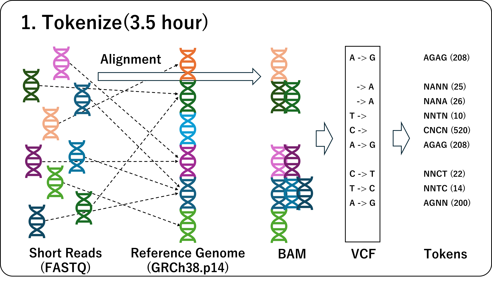
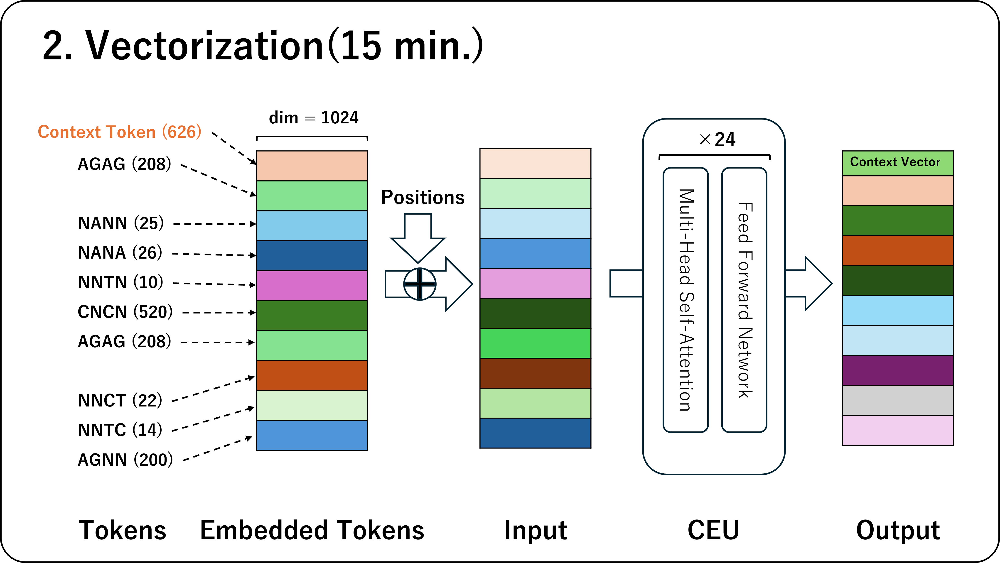
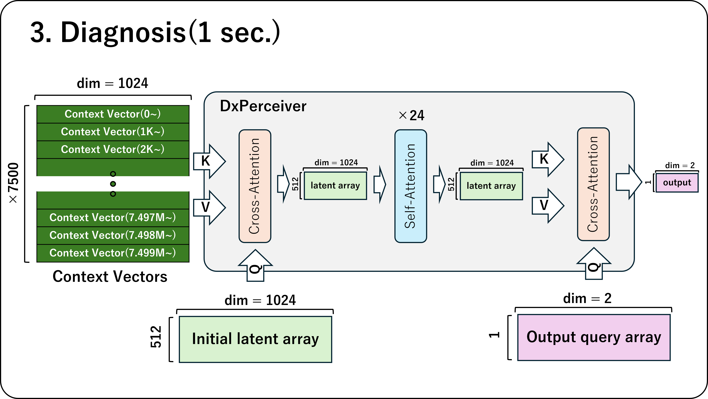
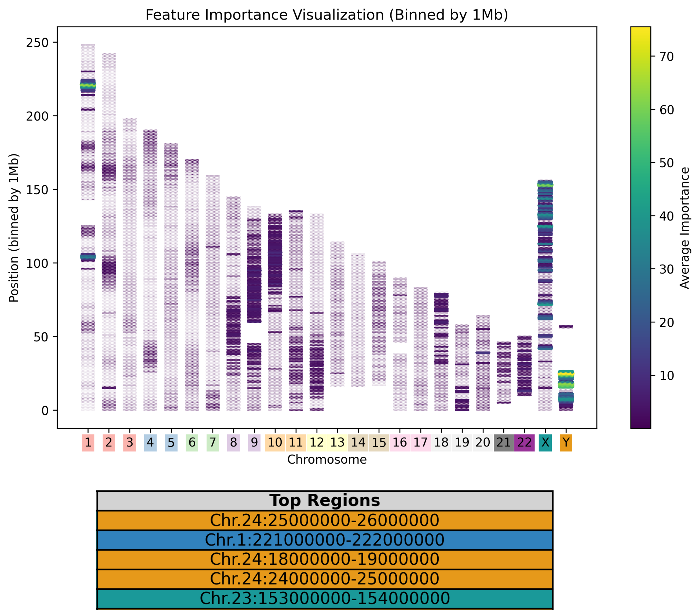
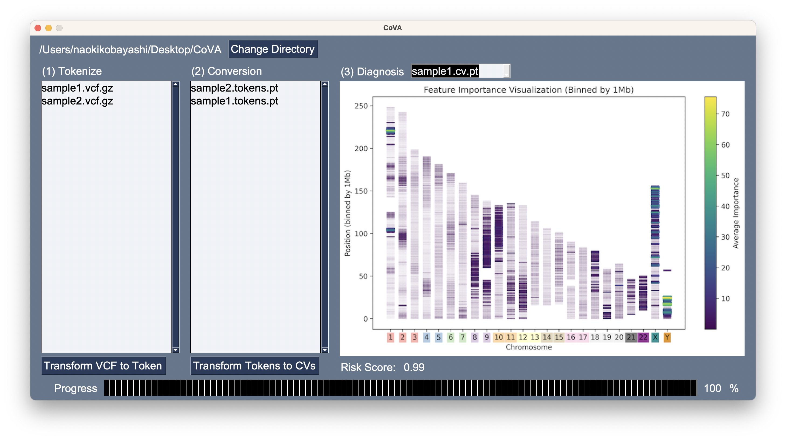

# CoVA(Contextual Variome Analyzer)

CoVA (Contextual Variome Analyzer) is a deep learning-based method designed for comprehensive analysis of all variant information in human genomes. It facilitates the processing and analysis of genomic data, transforming raw data into insights for research and potentially clinical applications.


## Getting Started
To use CoVA, follow the steps outlined below. These include data preprocessing, transformation into context vectors, and prediction of disease risk, exemplified here by ALS (Amyotrophic Lateral Sclerosis).

### Prerequisites
Ensure you have Python 3 installed on your system. Some scripts also require a Unix-like environment for execution.

Before you begin, make sure you have Python 3.x installed. Some parts of CoVA also require additional dependencies, which can be installed as follows:
```bash
pip install -r requirements.txt
```

### Step 1: Tokenization of Genomic Data
First, we transform VCF files into a tokenized format suitable for further analysis.


- Tokenizing VCF Files
To tokenize VCF files, use the following command:
``` bash
python tokenize.py <input directory> <output directory>
```
This script will process all VCF files within the `<input directory>`, adhering to the naming convention `<data_id>`.`<chr>`.vcf.gz, and produce corresponding recode files (in CSV format), tokens files (in PT format), and positions files (also in PT format) in the `<output directory>`.

- Converting FASTQ to VCF
It's strongly recommended to use our script for converting FASTQ format genomic data to VCF format for reliable results:
``` bash
fastq_to_vcf.sh <reference_file> <input_directory> <output_directory> <threads> <bam_directory>
```
This will generate VCF files for all FASTQ files in the `<input_directory>`, following the naming convention `<data_id>`_`<read_info_1>`_`<read_info_2>`.fastq.gz. The VCF files will be stored in directories named after their `<data_id>` within the `<output_directory>`.

To merge chromosome-specific files into a comprehensive VCF per dataset, use:
``` bash
merge_vcf.sh <parent_directory> <output_directory>
```

### Step 2: Conversion to Context Vectors

Transform tokens into context vectors with the following command:
``` bash
python to_cv.py <dataset_directory> <output_directory> <trained_ceu_model>
```
This script converts all token files in the `<dataset_directory>` into context vector files in the `<output directory>`. The trained_ceu_model is not publicly available; please contact us if required.

### Step 3: Predicting ALS Risk

To predict the risk of developing ALS based on the context vectors, use:
``` bash
python dx_als.py <dataset_directory> <output_directory> <trained_dx_model>
```
This will predict ALS risk for all context vector files in the `<dataset_directory>`, with results stored in the `<output directory>`. Label cases as "ALS" within the data_id for cases, exclude it for controls, and use "UNKNOWN" to exclude from accuracy calculation. The trained_dx_model is not publicly available; please contact us if required.

### Step 4: Visualize


## Desktop Application

We also provide desktop application.

## Contact
For access to the trained models or any inquiries, please contact us.

## License
CoVA is made available under the 000 License. For more information, see the LICENSE file in the repository.

## Citation
If you use CoVA in your research, please cite it as follows:
```bib
{

}
```